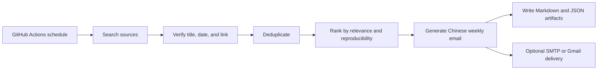

# Research Agent Toolkit

[](https://github.com/linshuijin6/research-agent-toolkit/actions/workflows/tests.yml)
[](https://github.com/linshuijin6/research-agent-toolkit/actions/workflows/literature-monitor.yml)
[](LICENSE)

**Research Agent Toolkit** turns a private research assistant workflow into an open, reproducible, GitHub Actions based literature-monitoring system.

It is designed for researchers who want scheduled AI literature digests without depending on paid agent platforms.

> v1.0 focuses on one production-ready workflow: **weekly literature and model-update monitoring for MRI-to-PET, Tau PET, Alzheimer's disease, medical vision-language models, medical CLIP-style models, GitHub releases, and Hugging Face model cards.**

简体中文说明见 [README.zh-CN.md](README.zh-CN.md).

---

## What you get

| Capability | v1.0 status |
|---|---:|
| Scheduled literature monitoring | Yes |
| NeuroPET / MRI-to-PET / Tau PET / AD preset | Yes |
| Medical VLM / medical CLIP / foundation-model preset | Yes |
| GitHub Actions automation | Yes |
| Chinese weekly email report | Yes |
| OpenAI-compatible LLM backend | Yes |
| SMTP email delivery | Yes, disabled by default |
| Gmail API sender | Experimental |
| Notion workflow | Planned, not in v1.0 |

See the [v1.0 completeness audit](docs/completeness-audit.zh-CN.md) for the exact release boundary.

---

## Why this project exists

Many researchers already use private AI agents to monitor papers, summarize updates, and send weekly reports. Most students and labs, however, do not have access to paid agent platforms. This repository makes that workflow forkable, inspectable, and cheaper to run.

The toolkit is especially useful for:

- biomedical engineering students;
- medical imaging researchers;
- PET (Positron Emission Tomography) / MRI (Magnetic Resonance Imaging) researchers;
- AI-for-science users who want scheduled literature digests;
- open-source maintainers who prefer transparent automation over black-box agents.

---

## Workflow overview



Default search flow:

1. Search the latest 7 days.
2. If strong results are insufficient, extend to 30 days.
3. Verify metadata before inclusion.
4. Keep at most 5 strong results per module and 3 indirect results.
5. Produce Markdown and JSON artifacts for every run.

---

## What it monitors

### Module A: NeuroPET / MRI-to-PET / Tau PET / AD

Default topics include:

- MRI-to-PET synthesis;
- pseudo-PET generation;
- Tau PET prediction and analysis;
- amyloid PET and FDG PET;
- PET reconstruction;
- multimodal neuroimaging for Alzheimer's disease;
- deep learning methods involving PET and MRI.

### Module B: Medical VLM / medical CLIP / foundation-model updates

Default topics include:

- medical vision-language models;
- biomedical CLIP-style models;
- radiology foundation models;
- GitHub repositories and releases;
- Hugging Face models, datasets, model cards, and dataset cards.

---

## Example output

The generated Chinese weekly email always uses six sections:

1. 本周期最重要结论
2. MRI-to-PET / Tau PET / Alzheimer's disease 强相关论文
3. 医学图像大模型 / 医学视觉语言模型更新
4. 间接相关但可能有启发的论文或模型
5. 未纳入内容与原因
6. 下周建议关注关键词

A demo report is available at [docs/demo-email.zh-CN.md](docs/demo-email.zh-CN.md).

---

## Quick start

```bash
git clone https://github.com/linshuijin6/research-agent-toolkit.git
cd research-agent-toolkit
python -m pip install --upgrade pip
pip install -e ".[dev]"
cp config.example.yaml config.yaml
rat validate-config --config config.yaml
rat literature-monitor --config config.yaml --dry-run
```

Generated files are written to:

```text
outputs/YYYY-MM-DD/
```

Typical outputs:

```text
email_zh.md
report.json
candidates.json
excluded.json
```

For a more detailed Chinese setup guide, see [docs/quickstart.zh-CN.md](docs/quickstart.zh-CN.md).

---

## Configuration

Minimal LLM settings:

```yaml
llm:
  provider: openai_compatible
  base_url_env: LLM_BASE_URL
  api_key_env: LLM_API_KEY
  model_env: LLM_MODEL
```

Example DeepSeek secrets:

```text
LLM_BASE_URL=https://api.deepseek.com
LLM_API_KEY=your_api_key
LLM_MODEL=deepseek-chat
```

Example OpenAI secrets:

```text
LLM_BASE_URL=https://api.openai.com/v1
LLM_API_KEY=your_api_key
LLM_MODEL=gpt-4o
```

Recommended GitHub Actions secrets:

```text
LLM_BASE_URL
LLM_API_KEY
LLM_MODEL
SEMANTIC_SCHOLAR_API_KEY
HUGGINGFACE_TOKEN
SMTP_HOST
SMTP_PORT
SMTP_USERNAME
SMTP_PASSWORD
SMTP_FROM
```

`GITHUB_TOKEN` is automatically available in GitHub Actions.

---

## GitHub Actions

The default workflow runs every Monday at 00:00 UTC, which is 08:00 Beijing time.

```yaml
on:
  schedule:
    - cron: "0 0 * * 1"
  workflow_dispatch:
```

The workflow runs in dry-run mode by default, uploads artifacts, and does not send email unless you explicitly enable delivery.

---

## Ranking formula

Each candidate receives a 0-100 priority score:

\[
S = 20\left(0.40R + 0.20N + 0.15C + 0.10P + 0.10Q + 0.05T\right)
\]

LaTeX source:

```latex
S = 20\left(0.40R + 0.20N + 0.15C + 0.10P + 0.10Q + 0.05T\right)
```

Where `R` is relevance, `N` is novelty, `C` is clinical or research value, `P` is reproducibility, `Q` is source quality, and `T` is timeliness.

---

## Safety principles

- No API key is committed to the repository.
- No email password is committed to the repository.
- Dry-run is enabled by default.
- Source verification is required by default.
- v1.0 does not read or write Notion.
- The workflow does not scrape paid full text or bypass website restrictions.
- The LLM is not allowed to invent paper titles, DOI values, code links, licenses, weights, or datasets.

---

## Roadmap

- v1.1: Gmail draft mode improvements.
- v1.2: MCP (Model Context Protocol) adapter.
- v1.3: Notion daily summary workflow.
- v1.4: Web dashboard.
- v1.5: More research-topic presets beyond biomedical imaging.

---

## Citation

If this project helps your research workflow, please cite the repository using [CITATION.cff](CITATION.cff).

## License

Apache License 2.0. See [LICENSE](LICENSE).
